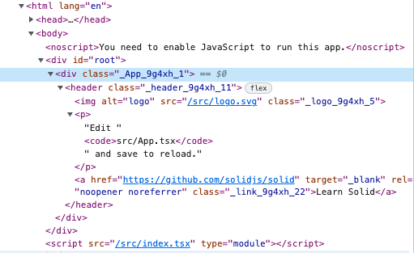

---

# Table of content:

- [Introduction](#introduction)
  * [Why? Just… Why?](#why-just-why)
  * [The app](#the-app)
  * [The stack](#the-stack)
  * [The structure of this article](#the-structure-of-this-article)
- [Learning Functional Programming with `fp-ts`](#learning-functional-programming-with-fp-ts)
  * [A quick introduction](#a-quick-introduction)
  * [Tool for the job](#tool-for-the-job)
  * [Core concepts](#core-concepts)
    + [Creating pipelines with `pipe` function](#creating-pipelines-with-pipe-function)
    + [The not-so-scary land of functors](#the-not-so-scary-land-of-functors)
    + [Your computations may fail - `Either` will tell you all about it](#your-computations-may-fail---either-will-tell-you-all-about-it)
    + [I’ve got a `Task` for you, but do it async](#i-ve-got-a-task-for-you-but-do-it-async)
    + [… But in the end, the task failed](#-but-in-the-end-the-task-failed)
  * [The “functional” part of our app](#the-functional-part-of-our-app)
    + [Closer look at Wikipedia API](#closer-look-at-wikipedia-api)
    + [Fetching data the FP way](#fetching-data-the-fp-way)
    + [Are you unsure about your data? Validate it with `zod`!](#are-you-unsure-about-your-data-validate-it-with-zod)
    + [Share with care - mapping the data](#share-with-care---mapping-the-data)
- [Learning Reactive Programming with SolidJS](#learning-reactive-programming-with-solidjs)
  * [What is SolidJS and why should you choose it?](#what-is-solidjs-and-why-should-you-choose-it)
  * [Tour around the codebase](#tour-around-the-codebase)
  * [SolidJS and its fine-grained reactivity](#solidjs-and-its-fine-grained-reactivity)
    + [What is reactivity or reactive programming?](#what-is-reactivity-or-reactive-programming)
    + [How does SolidJS let you create reactive data…](#how-does-solidjs-let-you-create-reactive-data)
    + [… and keep track of its changes?](#-and-keep-track-of-its-changes)
    + [Control flow components](#control-flow-components)
    + [Another ways of creating signals - deriving](#another-ways-of-creating-signals---deriving)
    + [Another way of creating signals - custom primitives](#another-way-of-creating-signals---custom-primitives)
  * [Let’s build our *solid* app](#let-s-build-our-solid-app)
    + [Event binding in SolidJS](#event-binding-in-solidjs)
    + [SolidJS has prepared us for the harsh, asynchronous world](#solidjs-has-prepared-us-for-the-harsh-asynchronous-world)
    + [Building your own reactive primitives](#building-your-own-reactive-primitives)
- [Tying this all up - functional and reactive](#tying-this-all-up---functional-and-reactive)
  * [The missing piece - pattern matching](#the-missing-piece---pattern-matching)
    + [Patterns, patterns everywhere - explaining the concept](#patterns-patterns-everywhere---explaining-the-concept)
    + [Pattern matching in TypeScript? I’m sold!](#pattern-matching-in-typescript-i-m-sold)
  * [Finishing the app - providing different view for different pattern](#finishing-the-app---providing-different-view-for-different-pattern)
- [Conclusion](#conclusion)

---

# Introduction

<br/>

## Why? Just… Why?

My first interaction with Functional Programming was three years ago. I was in awe on how different it was from programming I’ve known then (I was using Angular, TypeScript and Java at work) and how it can improve my coding skills. I am learning it bit by bit since then.

Then, I became fan of Reactive Programming as well. It all started with me using RxJS with Angular. Then, I found out a library called RxAngular that meant to improve state management and rendering aspects to Angular by leveraging full power of RxJS. Meanwhile, I saw frameworks like Vue and Svelte still topping the popularity charts. Also, last two years were significant to SolidJS and Qwik, which are getting more and more recognition among the community.

Realising that two of those worlds can be combined was inevitable at some point. Functional Reactive Programming is a paradigm that exists for decades and can be more valuable now then ever, especially for front-end development purposes.

Soon, fired up by things I’ve learned so far, I wanted to use those in action and create a simple web app using the Functional Reactive Programming approach. And well, this is the result. I’d like to share with you what I’ve learned and walk you through building this small app piece by piece.

<br/>

## The app

What we’ll build is a display for Wikipedia search results. We’ll use Wikipedia API to search available results by provided query and show it on a screen as a list of links.

Here’s our set of requirements:
- Add an input for our search query.
- After user provides the query, display data from API as a list of links matching the query.
- Do not trigger the API request until user is done with writing the query. In other words: do not query the API with every provided character.
- If the API call fails for some reason, provide user with a meaningful message of what went wrong.

Below you can find a demo of our working app. 

<iframe src="https://stackblitz.com/edit/solidjs-templates-rqjdg8?ctl=1&embed=1&file=src/App.tsx&view=preview" height="600px" width="100%"></iframe>

You can treat the above as TL;DR as well, as you can enter the code for the app in Stackblitz and see the final result for yourself 😉 

<br/>

## The stack

Choosing a perfect stack for the job was tough, as there are many great solutions. Here’s a summary of my stack. You’ll find the reason of why I chose what I chose below the list.

- TypeScript
- fp-ts
- SolidJS
- zod
- ts-pattern

The baseline was definitely using TypeScript as it is a golden standard of static typing in JavaScript ecosystem. I'm also very fond of it personally.

When comes to Functional Programming, there are not many libraries that leverage TypeScript fully. The biggest players I was aware of were `EffectTS` and `fp-ts`. I guess the title of this article may have already spoiled that I’ve chosen `fp-ts` for the job. The reason why was pretty subjective - those two libraries present different approach to writing FP code in TypeScript and `fp-ts` one felt closer to my heart.

As for Reactive Programming, the choice was not difficult - I haven’t even considered anything besides SolidJS. Again, a subjective choice, as this is [my recent favourite](https://kajetan.dev/speaking/introduction-to-solid-js/) front-end framework out there.

Additional libraries that we’ll use are `zod` to validate schema for data that’ll come from Wikipedia API and `ts-pattern` to introduce pattern matching to our code - a powerful tool for discriminating variants of our data.

We'll explain every library and framework I mentioned as we code our application.

<br/>

## The structure of this article

Because of how many things we have to touch, the article will have three parts.

In the first one we’ll code the “Functional Programming” parts of our application and I’ll teach you all the FP principles needed to complete our task.

The second one is all about “Reactive Programming” part. I’ll introduce you to SolidJS web framework and we’ll code first part of our application.

In the final part we’ll tie “Functional” and “Reactive” parts together and apply the knowledge we’ve learned to finish our task.

Without any further delay, let’s start diving into the Functional Programming world for our first part!

I think no further explanation is needed as I don’t want to waste your time with superficial introductions. We’ll see in action what tools for writing functional code `fp-ts` is providing us with.

---

# Learning Functional Programming with `fp-ts`

<br/>

## A quick introduction

If I were to sum up FP, I would say it is all about programming with pure functions and composition. I feel those two concepts need to be broken down in order to capture the bigger picture.

Pure function is the one that for the same input always returns the same output. You could compare it to mathematical functions you’ve seen at school. For example, `f(x) = 2x` is a function that for any `x` always returns a doubled value of `x`. The same principle is applied for pure functions in programming.

Composability is a concept of composing smaller units into bigger one. As for function composition, we compose functions with each other, thus implementing our program bit by bit.

Because of how easily pure functions compose with each other, we can think of our final programs as pipelines, where one value enters it and, after a series of operations applied to it, a new value of an expected shape is returned to the user.

> We’ll start coding soon. I think the best way for you to follow up is to spin up the [SolidJS-TypeScript template on Stackblitz](https://stackblitz.com/edit/solidjs-templates-4meomu?file=src/App.tsx), fork it, and enter your future code in the `src/App.tsx` file. You don’t need to know anything about SolidJS at this point. At least for now.

<br/>

## Tool for the job

As you know, we'll be using `fp-ts` to write functional code in our app. The best summary for `fp-ts` comes from its docs: "The goal of `fp-ts` is to empower developers to write pure FP apps and libraries built atop higher order abstractions. It includes the most popular data types, type classes, and abstractions from languages like Haskell, PureScript, and Scala".

We'll also use `fp-ts` to explain some core Functional Programming concepts with examples.

<br/>

## Core concepts

Aside of knowing the tools we’ll be working with, there are a couple of core FP concepts that I feel need to be explained before we start coding our app.

### Creating pipelines with `pipe` function

To continue the topic from the previous section, we use composition and compose our pure functions into bigger ones, as long as output of the first function matches (with its type) the input of the next one.

You can think of composing functions as applying matching LEGO bricks with each other - the bricks won’t stay connected unless both shapes match each other. If you succeed in placing two bricks of matching shape with each other, you’ll get a bigger piece.

When passing our value through multiple functions in JS/TS for the purpose of doing a multiple operations on it, it can look like this:

```tsx
// Example

const double = (x: number) => x * 2;
const add = (x1: number) => (x2: number) => x1 + x2;
const numberToString = (x: number) => `${x}`;

const someValue = 10;

const newValue = numberToString(add(double(someValue))(5));
```

As you can see, if you’d like to understand the sequence of operations here, you need to read right-to-left and process a lot of parentheses. Is it a problem to you or not - you decide.

The point is, when writing with a paradigm that is all about composition, you’ll need to write pipelines **a lot**. Wouldn’t it be nice to simplify the process then?

That’s why FP languages like Haskell, Elm, F# or PureScript have their own pipeline operators that allow you to pass your value through a pipeline of functions.

For example, in Elm, `|>` is the pipeline operator that lets you do just that.

```elm
someValue = 10

newValue = someValue |> double |> add 5 |> numberToString 
```

> Interestingly, there is an active [proposal for the pipeline operator](https://github.com/tc39/proposal-pipeline-operator) in JavaScript right now.

But we stranded too much of our TypeScript path here, let’s get back on it again. In JS and TS there is no pipeline operator and you cannot create your custom operators like some other languages can. But still, `fp-ts` allows us to create our pipelines with the `pipe` function:

```tsx
import { pipe } from 'fp-ts/function';

const double = (x: number) => x * 2;
const add = (x1: number) => (x2: number) => x1 + x2;
const numberToString = (x: number) => `${x}`;

const someValue = 10;

//    : string
const newValue = pipe(
  someValue,
  double,
  add(5),
  numberToString
);
```

> You probably noticed that the `add` function returns a function instead having two arguments. This is a common technique in FP called **currying**. It comes useful in multiple situations, for example when we want to **partially apply** (another common term in FP) an argument to a function and use the returned function in some pipeline. In the example above we partially applied `5` to the `add` function resulting in `x2 => 5 + x2` function which is used in the pipeline.

With `pipe` you can pass your initial value through a sequence of unary functions (functions accepting one argument), resulting in a new value. This sequence, like the example before it, is written left-to-right (or top-to-bottom, depending on code formatting). The number of parentheses is reduced as well.

Also, as `fp-ts` values type-safety, the type of our new value is correctly inferred from types of our composed functions. If you hover over the `newValue` you’ll see that the type for it is inferred as `string`, which is what we expect. TS compiler would also warn us if functions would be composed incorrectly, for example if we’d switch `double` and `numberToString` functions in the pipeline with each other.

### The not-so-scary land of functors

Coming to this part I realised how difficult is to provide a simple, pragmatic definition of a functor without even slightly touching on category theory. But hell, I’ll try, even risking a backlash from FP purists.

*Functor is anything mappable.*

There, I’ve said it.

To be more precise and to quote Giulio Canti from [his articles on common typeclasses implemented in fp-ts](https://dev.to/gcanti/getting-started-with-fp-ts-functor-36ek), functor is a pair of `(F, map)` where:
-  `F` is a type constructor (type constructor is a type accepting `n` generic types and returning a new type) of `n` arity (`n ≥ 1`)
- `map` is a function of a following signature:

```tsx
map: <A, B>(f: (a: A) => B) => ((fa: F<A>) => F<B>)
```

> For those interested, there are more rules to functor than just this, but the above ones are a must-know for our use-case. For example, functor must also apply rules of monoid, which also needs to apply rules of semigroup, and so on. If you’re interested, you can read more about functors [here](https://github.com/enricopolanski/functional-programming#functors) and [here](https://dev.to/gcanti/getting-started-with-fp-ts-functor-36ek).

Good news, you, as a JS/TS developer probably already know one functor, and that would be `Array<T>`.

`Array<T>` is a generic function (check ✅) that has an ability to be mapped over with `.map` method (check ✅). Although the `.map` is build-in to the type, we can easily define a standalone function `map` for `Array`:

```tsx
function map<A, B>(g: (b: A) => B): (fa: Array<A>) => Array<B> {
  return fa => fa.map(g)
}
```

All we had to do was to replace the `F` type with the `Array` type and provide body of the function.

“So what’s the point of generalising something straightforward like this?”, you may ask.

The point is that:
1) When doing FP programming you’ll often find a need to apply different behaviours to your types. That’s why [type classes](https://serokell.io/blog/haskell-typeclasses) like `Functor`, `Eq` (for defining data equality) or `Ord` (for defining how data should be ordered) exist.
2) As for functors, there are a lot of smart and useful functors out there that represent different computations (for `Array` the “computation” is simply an ability to store multiple values) that help us solve common programming problems. You’ll get to know some of them soon.

### Your computations may fail - `Either` will tell you all about it

Applications I write often show errors to the user - not because my lack in coding abilities (it is an existing factor, but that’s not the point here), but because this is the intention.

Some things are outside of our control, as developers - file which we want to read has incorrect format or extension, API we want to query is not available anymore, user suddenly lost an internet connection, etc.

In situations like this we want to fail gracefully and show the user that everything is under control and to guide them through the tough times.

Like every other paradigm, FP has its own solution for handling errors which gives us superpowers, and that is the `Either` type (also called `Result` in other libraries or languages). `Either` in `fp-ts` is defined like this:

```ts
type Either<E, A> = Left<E> | Right<A>

export interface Left<E> {
  readonly _tag: 'Left'
  readonly left: E
}

export interface Right<A> {
  readonly _tag: 'Right'
  readonly right: A
}
```

Where `E` is a type for an error and `A` is type of our data.

`Either` is a union of `Right`, which represents the result of our computation, and `Left`, which represents error that may have occurred during resolving of said computation. It's always either one of two.

`Either` is a functor, just as the `Array`, so you can map over it:

```ts
// Example

import * as E from 'fp-ts/Either';

// Create an instance of Right with `of` function
const price = E.of(1000); // E.Either<never, number>

// Map the underlying value
const priceString = E.map((v) => `${v}`)(price); // E.Either<never, string>
```

As you can see you can transform the result of your computation without unwrapping and wrapping the underlying value of `Either`. Out data type is also correctly inferred from the mapping we’ve conducted. Error is of type `never` here because we didn’t provide any information about what is the possible error here.

But what’s really cool about `Either` is just how errors are handled. See the example below:

```ts
// Example

import * as E from 'fp-ts/Either';

// Let's assume our comutation ended up in an error
const price: E.Either<Error, number> = E.left(
  new Error('Something went wrong and price is not available')
);

// Map the underlying data, whatever it is
const priceString = E.map((v) => `${v}`)(price); // E.Either<Error, string>

console.log(priceString);
/*
  {
    "_tag": "Left",
    "left": Error {
      message: "Something went wrong and price is not available"
    }
  }
*/
```

As you can see, even though the error had happened, we can still operate on our `Either`. No errors are thrown or shown to the user, unless we do it intentionally. What happens is that when the `Either` is `Left`, the mapping doesn't even happen - the `Left` value containing error is returned unchanged.

What I like about `Either` is the control it gives us and the ability to explicitly declare what errors are to be expected from the computations we are about to perform. In other words: `Either` with its underlying data and error are type-safe.

If you recall the `try-catch` block from JS/TS, you probably already know that any error caught by the `catch` block is `unknown` by default. It’s up to you to add some logic to narrow the specific type and only then you can handle it.

> If you want to deal with computations that may fail, but you don’t need specific info about an error, there’s an [`Option` type](https://dev.to/ryanleecode/practical-guide-to-fp-ts-option-map-flatten-chain-6d5) (also called `Maybe` in other solutions) designed just for that.

### I’ve got a `Task` for you, but do it async

What's JavaScript application without asynchronous computations? `Promise` is a well known way to handle async code in JavaScript land.

`fp-ts` has it's own abstraction for handling async as well. `fp-ts` lets you define async tasks by using `Task`. `Task` is nothing more than a function that returns a Promise (in other words a lazy `Promise` or a [thunk](https://en.wikipedia.org/wiki/Thunk)):

```ts
type Task<A> = () => Promise<A>
```

But what’s more to know, is that the intention of the `Task` is to represent async computations that **always succeed**.

The difference between `Promise` and `Task` is that we’ll never know whether the `Promise` will `resolve` or `reject` (whether it’ll succeed or fail) and with `Task` we know that the intention was to provide async computation that never fails.

This is an important distinction because of how thorough typed FP is with its “leave no type undeclared” approach. And you’ll soon see how to deal with async operations that may fail.

Again, `Task` is a functor as well! You can map data that are the result of your `Promise` and create a new “lazy” `Promise` from it:

```ts
// Example

import * as T from 'fp-ts/Task';

// Imagine the user data comes from API. This is a "lazy" Promise, 
// so it won't resolve immidiately.
const userTask = T.of({ name: 'john' }); // T.Task<{name: string}>

// You can declare series of transformations to your underlying data
const usernameTask = pipe(
  userTask,
  T.map((u) => u.name)
); // T.Task<string>

// When you run the Promise, the declared transformatioms 
// are applied to the result
const username = await usernameTask(); // string
```

### … But in the end, the task failed

As we have already mentioned, it is completely normal for our functions and programs to result in errors. We already established that a way to handle computation that may fail is the `Either` type. But we didn’t mention, that this is actually correct for the **synchronous** parts of our code. So what about async?

The solution is brilliant in its simplicity - if we combine `Task` that handles our async code and `Either` that handles computations that may fail we get… 🥁🥁🥁 `TaskEither`!

In other words, `TaskEither` represents asynchronous computation that may fail.

The type itself is nothing more than:

```ts
interface TaskEither<E, A> extends Task<Either<E, A>> {}
```

Where `E` is a generic type for an error and `A` is type of our data.

Small spoiler here, but this is what we’ll ultimately use in our code: we’ll get our `fetch()` call to Wikipedia API to result in `TaskEither<WikiResultsError, WikiResultsData>`, where each error is explicitly declared and data parsed from JSON is correctly typed.

We’ll see more on `TaskEither` when we’ll get to write our application…

Which happens to be now! Let’s get to it then. 

> For those interested, you can find more about `Task` and `TaskEither` [here](https://dev.to/ryanleecode/practical-guide-to-fp-ts-p3-task-either-taskeither-2hpl) and [here](https://grossbart.github.io/fp-ts-recipes/#/async).

<br/>

## The “functional” part of our app

### Closer look at Wikipedia API

Let’s see what is the exact example output of an example `GET https://en.wikipedia.org/w/api.php?action=opensearch&origin=*&search=bear` call, which searches out all result for the "bear" query:

```json
[
  "bear",
  [
    "Bear",
    "Bear Grylls",
    "Beard",
    "... more results"
  ],
  [
    "",
    "",
    "",
    "... more empty strings"
  ],
  [
    "https://en.wikipedia.org/wiki/Bear",
    "https://en.wikipedia.org/wiki/Bear_Grylls",
    "https://en.wikipedia.org/wiki/Beard",
    "... more results"
  ]
]
```

As you can see, the actual type for our JSON response is a tuple: 

```ts
[string, string[], string[], string[]]
```

As we see from the example above, the response tuple consists of:
- search query as `string`
- titles of Wiki articles as `string[]`
- list of empty strings (I dug out that some time ago this was a list of Wiki article contents, but those were reduced to empty strings due to optimizations)
- links for Wiki articles as `string[]`(each link matches the titles of articles by index)

The second and fourth element is what interests us the most. Based on that data we’ll build the list of links in our UI.

### Fetching data the FP way

In this section, and until the end of the "functional programming" part of the article, we’ll focus on writing our fetch call to Wikipedia API that will return our data.

Pfff, not a problem, that’s a one-liner!

```ts
const fetchWikiResults = (query: string) => 
	fetch(`https://en.wikipedia.org/w/api.php?action=opensearch&origin=*&search=${query}`)
		.then(r => r.json());
```

(Well, not exactly in one-liner, but only due to the formatting.)

Done! I’m outta here! I commend you on reading so much text just to write a simple `fetch` call. Just kidding, of course.

This is what what most of use would write. Maybe we’d wrap it in some `try-catch` as well to make sure we have it all covered. Possibly doing some if-statements in `catch` to differentiate between errors as well (given that we know what they are).

First thing that we can inspect in this code snippet is the inferred type. It is, in fact, `(query: string) => Promise<any>`. What strikes us immediately is the `any` type. This is to be expected though: Fetch API doesn’t have a clue on what data type to expect from the API. After all, it’s indeterministic and totally unrelated to our codebase.

We can be clever about this and declare the type:

```tsx
const fetchWikiResults = (query: string): Promise<[{ link: string }]> => 
	fetch(`https://en.wikipedia.org/w/api.php?action=opensearch&origin=*&search=${query}`)
		.then(r => r.json());
```

But are you sure that the JSON data that is returned from the API is of type `[{ link: string }]`. Are you really, REALLY sure?

Because in this case, it sure **isn’t** the correct data type. The compiler allowed us to write anything we wished. And if we made a mistake or creators of the API would change something, we and our users would only guess why our app crashed.

The goal of this part is to write the `fetchWikiResults` function resulting in `TaskEither<E,A>`. This way we’ll have everything on a plate - what possible errors are and what is the expected shape of our data.

Let’s start with defining our resulting data type. We’ll not use the `[string, string[], string[], string[]]` tuple type of our data as it’s not that meaningful. At some point we’ll convert it to something more descriptive:

```ts
type WikiResultsData = {
  title: string;
  content: string;
  href: string;
}[];
```

We’ll map the second element of the tuple to the title, third to content, and so on. This way we’ll have an array of objects with corresponding informations - all in one place instead of scattered around.

As for the error type, let’s start with something simple:

```ts
type WikiResultsError = unknown;
```

Don’t worry, it won’t stay like that forever - we’ll build up our “list of errors” as we write our function.

Now on to the most important question - how to translate `Promise` to a `TaskEither`?

This is something that the `tryCatch` from `fp-ts` can help us with:

```ts
const tryCatch: <E, A>(f: Lazy<Promise<A>>, onRejected: (reason: unknown) => E) => TaskEither<E, A>
```

As you can see from the type of the `tryCatch`, it accepts two arguments: a “lazy” promise (thunk) and handler for the error. Let’s use it to start writing our `fetchWikiResults` function:

```ts
const fetchWikiResults = (query: string) =>
  TE.tryCatch(
    () =>
      fetch(
        `https://en.wikipedia.org/w/api.php?action=opensearch&origin=*&search=${query}`
      ),
    (error) => {/* ... */}
  );
```

We added our main `fetch()` call to Wikipedia API in the “lazy” form as a first argument. The second one serves as a handler for any error that may occur while running the `fetch()`.

The `error` argument in the callback here is inferred as `unknown`, just as it would in the `try-catch` block. Our job is to provide a specific type for our error.

As MDN says: “**A fetch() promise only rejects when a network error is encountered** (which is usually when there's a permissions issue or similar)”. 

That’s what we’ll use here. We’ll create our own custom `NetworkError` and provide it as the specific error that can occur:

```ts
/**
 * This is returned when there a network failure is encountered 
 * or if anything prevented the request from being completed.
 */
export class NetworkError extends Error {
  readonly _tag = 'NetworkError';

  public constructor(message = '') {
    super(message);
  }
}
```

(You can see I assigned the `NetworkError` class a unique `_tag` as one of the properties. You’ll get to know why in the future.)

And use it in `fetchWikiResults`:

```tsx
const fetchWikiResults = (query: string) =>
  TE.tryCatch(
    () =>
      fetch(
        `https://en.wikipedia.org/w/api.php?action=opensearch&origin=*&search=${query}`
      ),
    (error) => new NetworkError((error as Error).message)
  );
```

This way, when we hover over the `fetchWikiResults`, we’ll see that proper `TaskEither` type is already inferred:

```ts
const fetchWikiResults: (query: string) => TE.TaskEither<NetworkError, Response>
```

This is a great first step! 

But we know that we need to extract JSON data out of the `Response` instance. And no, we won’t add `.then(r => r.json())` at the end of the `fetch()` here, oh no, no.

We have to realise, that during the `r.json()` step, another error may happen. As we read on MDN: “The `json()` method of the `Response` interface takes a `Response` stream and reads it to completion. It returns a promise which resolves with the result of parsing the body text as JSON”. So what can happen, rarely or not, is a JSON parser error. Let’s document it in our code as well:

```tsx
/**
 * This is returned when response parser is unable to convert
 * response body to the desired format.
 */
export class ParserError extends Error {
  readonly _tag = 'ParserError';

  public constructor(message = '') {
    super(message);
  }
}
```

(You can see I assigned the `ParserError` class a unique `_tag` as one of the properties. You’ll get to know why in the future.)

Now we have to somehow “transform” our existing `TaskEither` to hold our parsed JSON object, instead the `Response` instance.

”Use `map`! `TaskEither` is a functor!” - you may say. Let’s do it then! But remember, `Response.json()` ends up in a promise, so we have to convert it to `TaskEither` as well!

It’s a good moment to introduce `pipe` to our definition, otherwise we may end up in too much parentheses and nesting:

```ts
import * as TE from 'fp-ts/TaskEither';
import { pipe } from 'fp-ts/function';

const fetchWikiResults = (query: string) =>
  pipe(
    TE.tryCatch(
      () =>
        fetch(
          `https://en.wikipedia.org/w/api.php?action=opensearch&origin=*&search=${query}`
        ),
      (error) => new NetworkError((error as Error).message)
    ),
    TE.map((response) =>
      TE.tryCatch(
        () => response.json(),
        (error) => new ParserError((error as Error).message)
      )
    )
  );
```

As you can see I already went ahead and used both `TE.map` and the second `TE.tryCatch`. With `map` we get access to the underlying `Response` instance (with `response` callback argument), hence we can use the second `tryCatch` to convert `response.json()`'s `Promise` to a `TaskEither`. We also declared that we may anticipate a `ParserError` from doing `response.json()` call.

Let’s now see how `fetchWikiResults`'s type is inferred by TS compiler:

```ts
const fetchWikiResults: (query: string) => TE.TaskEither<NetworkError, TE.TaskEither<ParserError, any>>
```

Well… This is not something that we may want as the end result. We can clearly see the nested `TaskEither` within the `TaskEither`. If we leave it like this, it’ll only add an extra layer of difficulty to any user of the `fetchWikiResults` function.

Is there a way to squash or flatten those two `TaskEither`s into one…?

Of course there is! We wouldn’t get to this point otherwise 😉

The `TE.flatten` function exists just for that:

```ts
import * as TE from 'fp-ts/TaskEither';
import { pipe } from 'fp-ts/function';

const fetchWikiResults = (query: string) =>
  pipe(
    TE.tryCatch(
      () =>
        fetch(
          `https://en.wikipedia.org/w/api.php?action=opensearch&origin=*&search=${query}`
        ),
      (error) => new NetworkError((error as Error).message)
    ),
    TE.map((response) =>
      TE.tryCatch(
        () => response.json(),
        (error) => new ParserError((error as Error).message)
      )
    ),
    TE.flatten
  );
```

Now when hovering over the `fetchWikiResults` we see:

```tsx
const fetchWikiResults: (query: string) => TE.TaskEither<ParserError, any>
```

Now that’s better. But wait, where did the `NetworkError` go? We clearly have it in the definition, but it got lost somewhere in the type system.

There is a quick fix to this issue, and it’s an alternative to `TE.flatten` called `TE.flattenW`. `TE.flattenW` is does pretty much the same, but, as API docs say: “The `W` suffix (short for **W**idening) means that the error types will be merged”. It’ll simply merge any error type definitions that occur across the pipeline.

Again, let’s change it:

```tsx
import * as TE from 'fp-ts/TaskEither';
import { pipe } from 'fp-ts/function';

const fetchWikiResults = (query: string) =>
  pipe(
    TE.tryCatch(
      () =>
        fetch(
          `https://en.wikipedia.org/w/api.php?action=opensearch&origin=*&search=${query}`
        ),
      (error) => new NetworkError((error as Error).message)
    ),
    TE.map((response) =>
      TE.tryCatch(
        () => response.json(),
        (error) => new ParserError((error as Error).message)
      )
    ),
    TE.flattenW
  );
```

And peek the inferred type:

```ts
const fetchWikiResults: (query: string) => TE.TaskEither<NetworkError | ParserError, any>
```

Perfect! Now the type definitions are merged and we can see it as a union: `NetworkError | ParserError`.

We can simplify this code by replacing sequence of `map` and `flatten` with just one call of another function - `chain`:

```ts
const fetchWikiResults = (query: string) =>
  pipe(
    TE.tryCatch(
      () =>
        fetch(
          `https://en.wikipedia.org/w/api.php?action=opensearch&origin=*&search=${query}`
        ),
      (error) => new NetworkError((error as Error).message)
    ),
    TE.chainW((response) =>
      TE.tryCatch(
        () => response.json(),
        (error) => new ParserError((error as Error).message)
      )
    )
  );
```

We use `chainW` here instead of `chain` for the same reason we used `flattenW` in place of `flatten`.

> 🏆 Congratulations! You’ve unlocked the achievement: “Monad Beginner”! 
>
> Yes, that’s right, what you’ve just witnessed is the legendary “monad”. All monads define a function called `chain` (or `bind` or `flatMap` in other solutions) that allow you to chain computations with each other. And that’s what we did: we chained together two `TaskEither`s. Just to let you know, all functors you’ve learned so far - `Array`, `Either` and `Task` - have monad instances as well. 

We’re almost done! The last bit that’s left is to get rid of this nasty `any` from our data type.

### Are you unsure about your data? Validate it with `zod`!

The next thing we’ll do is to ensure the data that comes from the Wikipedia API has the expected shape. This way we’ll be sure that the type is correct so we can sleep better, not worrying about unexpected runtime errors.

For this task we’ll use [`zod`](https://zod.dev/). To quickly quote the official docs: “Zod is a TypeScript-first schema declaration and validation library. (…) With Zod, you declare a validator once and Zod will automatically infer the static TypeScript type. It's easy to compose simpler types into complex data structures”.

Let’s see it in action for the simplest of examples. Here we want to validate that our unknown data is of type `string`:

```tsx
// Example

import { z } from 'zod';

// Tell the compiler to treat our test data as `unknown` type
const test = 'I am a very important piece of data' as unknown;

// Create zod schema for our expected data
const TestSchema = z.string();

// Parse our unknown data using the schema
const parsedTest = TestSchema.parse(test);
console.log(parsedTest);
```

The idea is quite straightforward: we create `zod` schema using one of many [schema primitives](https://zod.dev/?id=primitives), then use `parse` method to parse validate our data against provided schema. In case of success, the `parse` method would just return our value unchanged, but the type would be correctly inferred from that moment(`parsedTest` is now `string`). In case of failure, `parse` throws an instance of `ZodError`.

In case you don’t like throwing errors around, there’s a `safeParse` method as well, which returns a value of type:

```ts
{ success: true, data: T } | { success: false, error: ZodError }
```

Where `T` is the expected type of our data inferred from `zod` schema.

Now, back to the `fetchWikiResults` function, let me remind you the expected shape for the JSON data that comes from Wikipedia API:

```ts
[string, string[], string[], string[]]
```

We would like to create a `zod` schema for the exact type above. We can create more complex schemas out of the combinators, like this:

```ts
import { z } from 'zod';

const WikipediaResult = z.tuple(/* ... */);
```

The `tuple` function expects an array of smaller schemas as its argument, that will represent the corresponding elements of the tuple. The first element of the tuple is of type `string`, so let’s add it:

```ts
import { z } from 'zod';

const WikipediaResult = z.tuple([z.string()]);
```

The last three elements are `string[]`, so we need to add those as well. Conveniently, there is also a schema helper/combinator for arrays. Let’s see it in action:

```ts
import { z } from 'zod';

const WikipediaResult = z.tuple([
  z.string(),
  z.array(z.string()),
  z.array(z.string()),
  z.array(z.string())
]);
```

`array()` function accepts a schema of expected data type that the array will hold - `string` in this case.

We are done with the schema. What’s also magical about `zod` is that we can easily extract the type out of schema. Let me show you how:

```ts
type WikipediaResult = z.infer<typeof WikipediaResult>;
```

And that’s it! If you hover over the `WikipediaResult` type above, you’ll see

```ts
type WikipediaResult = [string, string[], string[], string[]]
```

Now you have both schema and a type derived from it, without a need to duplicate anything.

Now we can use schema and it’s `safeParse` method, and chain a new `TaskEither` created out of the (potentially successfully) parsed data:

```ts
import { pipe } from 'fp-ts/function';
import * as TE from 'fp-ts/TaskEither';
import { z } from 'zod';

const WikipediaResult = z.tuple([
  z.string(),
  z.array(z.string()),
  z.array(z.string()),
  z.array(z.string())
]);

const fetchWikiResults = (query: string) =>
  pipe(
    TE.tryCatch(
      () =>
        fetch(
          `https://en.wikipedia.org/w/api.php?action=opensearch&origin=*&search=${query}`
        ),
      (error) => new NetworkError((error as Error).message)
    ),
    TE.chainW((response) =>
      TE.tryCatch(
        () => response.json(),
        (error) => new ParserError((error as Error).message)
      )
    ),
    TE.chainW((payload) => {
      const parsed = WikipediaResult.safeParse(payload);
      return parsed.success ? TE.right(parsed.data) : TE.left(parsed.error);
    })
  );
```

We are using `chain` (or `chainW` to be more precise) instead of just `map`, because we’d like to keep information on both data and error. That’s why we create a new `TaskEither` by using `TE.right` and `TE.left` functions respectfully. 

If we’d like, we can generalise the `fp-ts` and `zod` integration here and create a utility function for parsing/decoding with `zod` that results with `Either`, instead the `{ success: true, data: T } | { success: false, error: ZodError }` union:

```ts
import { z } from 'zod';
import * as E from 'fp-ts/Either';

export const decode =
  <T>(schema: z.ZodType<T>) =>
  (value: T): E.Either<z.ZodError<T>, T> => {
    const parsed = schema.safeParse(value);
    return parsed.success ? E.right(parsed.data) : E.left(parsed.error);
  };
```

And replace the last `chainW` in the pipeline with:

```tsx
TE.chainW((payload) => TE.fromEither(decode(WikipediaResult)(payload)))
```

Where `fromEither` function creates a `TaskEither` from `Either`.

No matter which of the two solutions you’ll choose, if you hover the `fetchWikiResults` function now, you’ll see that it’s type is inferred to:

```ts
const fetchWikiResults: (query: string) => TE.TaskEither<
  NetworkError | ParserError | z.ZodError<[string, string[], string[], string[]]>, 
  [string, string[], string[], string[]]
>
```

This gives us now a very clear view of what to expect of this asynchronous computation: we can expect one of three errors or data of a specific shape - that’s terrific! 

Now let’s jump to the last, easiest part of building our pipeline.

### Share with care - mapping the data

Sometimes the data that comes from the API is not clear enough or well documented. This is somewhat the case here. If we create the `fetchWikiResults` and leave it like we left it in the last section, other people may scratch their heads when they read the code.

”What the hell is this `[string, string[], string[], string[]]`? What data does every array hold?”

That’s why we’ll safe our colleagues (and ourselves in the future) the effort and frustrations and transform our data to something more meaningful, from the above tuple to:

```ts
type WikiResultsData = {
  title: string;
  content: string;
  href: string;
}[];
```

You may remember this, this is a type that we’ve mentioned at the beginning.

Try to do it yourself. To sum up - the exercise is to map underlying `TaskEither` data, changing it from:

```tsx
TaskEither<
  NetworkError | ParserError | z.ZodError<[string, string[], string[], string[]]>, 
  [string, string[], string[], string[]]
>
```

To:

```tsx
TaskEither<
  NetworkError | ParserError | z.ZodError<[string, string[], string[], string[]]>, 
  WikiResultsData
>
```

And to remind you what are the corresponding elements of the array, here they are:
- search query as `string`
- titles of Wiki articles as `string[]`
- list of empty strings (later I dug out that some time ago this was a list of Wiki article contents)
- links for Wiki articles as `string[]`(each link matches the titles of articles by index)

Just to help you a bit, I’ll just say that you should use what you know about `TaskEither` being a functor!

And…

Here’s how I’d implement this:

```ts
import { pipe } from 'fp-ts/function';
import { z } from 'zod';
import * as TE from 'fp-ts/TaskEither';
import { NetworkError, ParserError } from './errors';

const WikipediaResult = z.tuple([
  z.string(),
  z.array(z.string()),
  z.array(z.string()),
  z.array(z.string()),
]);

const fetchWikiResults = (query: string) =>
  pipe(
    TE.tryCatch(
      () =>
        fetch(
          `https://en.wikipedia.org/w/api.php?action=opensearch&origin=*&search=${query}`
        ),
      (error) => new NetworkError((error as Error).message)
    ),
    TE.chainW((response) =>
      TE.tryCatch(
        () => response.json(),
        (error) => new ParserError((error as Error).message)
      )
    ),
    TE.chainW((payload) => {
      const parsed = WikipediaResult.safeParse(payload);
      return parsed.success ? TE.right(parsed.data) : TE.left(parsed.error);
    }),
    TE.map(([, titles, contents, hrefs]) =>
      titles.map((title, i) => ({
        href: hrefs[i],
        title,
        content: contents[i],
      }))
    )
  );
```

Now if we check the inferred type of the `fetchWikiResults` function, this would now be:

```tsx
const fetchWikiResults: (query: string) => TE.TaskEither<
  NetworkError | ParserError | z.ZodError<[string, string[], string[], string[]]>,
  {
    href: string;
    title: string;
    content: string;
  }[]
>
```

Which is exactly what we wanted. For simplifying the type of the function itself, we can use the `WikiResultsData` and `WikiResultsError` types that we’ve created:

```ts
import { z } from 'zod';

const WikipediaResult = z.tuple([
  z.string(),
  z.array(z.string()),
  z.array(z.string()),
  z.array(z.string()),
]);

type WikipediaResult = z.infer<typeof WikipediaResult>;

type WikiResultsData = {
  href: string;
  title: string;
  content: string;
}[];

type WikiResultsError =
  | NetworkError
  | ParserError
  | z.ZodError<WikipediaResult>;
```

(You can see that we’ve changed the `WikiResultsError` type we’ve mentioned before (initially set to `unknown`) to a full union of our expected types.)

And now, to the final solution for the `fetchWikiResult`:

```tsx
// src/fetch-wiki-results.ts

import * as TE from 'fp-ts/TaskEither';
import { pipe } from 'fp-ts/function';
import { z } from 'zod';
import { NetworkError, ParserError } from './errors';

const WikipediaResult = z.tuple([
  z.string(),
  z.array(z.string()),
  z.array(z.string()),
  z.array(z.string()),
]);

type WikipediaResult = z.infer<typeof WikipediaResult>;

export type WikiResultsData = {
  href: string;
  title: string;
  content: string;
}[];

export type WikiResultsError =
  | NetworkError
  | ParserError
  | z.ZodError<WikipediaResult>;

export const fetchWikiResults = (
  query: string
): TE.TaskEither<WikiResultsError, WikiResultsData> => {
  return query === ''
    ? TE.of([])
    : pipe(
        TE.tryCatch(
          () =>
            fetch(
              `https://en.wikipedia.org/w/api.php?action=opensearch&origin=*&search=${query}`
            ),
          (error) => new NetworkError((error as Error).message)
        ),
        TE.chainW((response) =>
          TE.tryCatch(
            () => response.json(),
            (error) => new ParserError((error as Error).message)
          )
        ),
        TE.chainW((payload) => {
          const parsed = WikipediaResult.safeParse(payload);
          return parsed.success ? TE.right(parsed.data) : TE.left(parsed.error);
        }),
        TE.map(([, titles, contents, hrefs]) =>
          titles.map((title, i) => ({
            href: hrefs[i],
            title,
            content: contents[i],
          }))
        )
      );
};
```

(Notice that I’ve added a condition at the beginning of the `fetchWikiResults` function. This is because when the search query is empty, the API call fails. We don’t want that, as the empty string is a default state of our search query, and also user can just remove everything from the search query input. In other words: we want to default to something safe when search query is empty.)

Great! We are now done with the core “functional programming” part of our application.

The only thing I’d do as well, is to refactor this code into its own module. I called it, as an example, `src/fetch-wiki-results.ts`.

There are definitely some FP concepts that we’ll touch on during the rest of our journey, but it’d be nothing as complex as those that you’ve already seen. You should be proud of yourself for coming this far! I sure am happy for you.

---

# Learning Reactive Programming with SolidJS

> If you want to go through an interactive journey around SolidJS, I recommend you [the official SolidJS tutorial](https://www.solidjs.com/tutorial/introduction_basics). You can learn everything about SolidJS’ principles and API there - its creators did a solid (pun intended) job on creating this.

<br/>

## What is SolidJS and why should you choose it?

There are [many](https://www.solidjs.com/tutorial/introduction_basics), [many](https://www.youtube.com/watch?v=hw3Bx5vxKl0), [many](https://dev.to/ryansolid/why-solidjs-do-we-need-another-js-ui-library-1mdc) resources on what SolidJS is and how it differs from other frameworks. A lot of people smarter than me have already answered this question, so I’ll just provide you with a brief explanation to not to repeat the same work over and over.

SolidJS is a framework created by [Ryan Carniato](https://twitter.com/RyanCarniato) that allows you to create web apps. Main selling points of SolidJS are:
1. Performance (you can find JS benchmarks and compare SolidJS with other frameworks [here](https://krausest.github.io/js-framework-benchmark/index.html)).
2. Fine-grained reactivity in shape of “reactive primitives” that let you manage your data/state and link your (reactive) data to specific elements of the UI in a granular way.

I think actions speak louder than words, so you’ll find out exactly how coding with SolidJS looks like in next sections.

<br/>

## Tour around the codebase

If you have already completed the sections above (from building the “FP part” of our app), you should already have an application set up on Stackblitz. If not, please go to [this template](https://stackblitz.com/edit/solidjs-templates-4meomu?file=src/App.tsx), and fork it for your own use.

SolidJS, as many front-end frameworks before it, uses **components** to modularise and re-use parts of our UI.

Components in SolidJS are functions that take props as arguments, and return HTML that should be rendered on our screens. The simplest example there is for a component is:

```tsx
const App = () => 'Hello World';
```

Which is a function that takes no props and returns a static string of `'Hello World'`.

You can find another example of a component  in our application in `src/App.tsx` file - the `App` component.

There you can see that the `App` function returns a HTML:

```tsx
// src/App.tsx

import type { Component } from 'solid-js';

import logo from './logo.svg';
import styles from './App.module.css';

const App: Component = () => {
  return (
    <div class={styles.App}>
      <header class={styles.header}>
        
        <p>
          Edit <code>src/App.tsx</code> and save to reload.
        </p>
        <a
          class={styles.link}
          href="https://github.com/solidjs/solid"
          target="_blank"
          rel="noopener noreferrer"
        >
          Learn Solid
        </a>
      </header>
    </div>
  );
};
```

This is not normally possible in JavaScript or TypeScript syntax. It is possible here because SolidJS uses **JSX**, which is a syntax extension for our JS/TS that allow writing markup inline, alongside our JS/TS code.

If we inspect our application in Chrome DevTools, we can see the following HTML elements:




As you can see, our `div` element containing `header` is a child of `<div id="root"></div>` element. If you’d like to see where this originates from, check out the `./index.html` file:

```html
<!-- ./index.html -->

<!DOCTYPE html>
<html lang="en">
  <head>
    <meta charset="utf-8" />
    <meta name="viewport" content="width=device-width, initial-scale=1" />
    <meta name="theme-color" content="#000000" />
    <link rel="shortcut icon" type="image/ico" href="/src/assets/favicon.ico" />
    <title>Solid App</title>
  </head>
  <body>
    <noscript>You need to enable JavaScript to run this app.</noscript>
    <div id="root"></div>

    <script src="/src/index.tsx" type="module"></script>
  </body>
</html>
```

This is the root HTML file of our application. Within its `body` tag there is the aforementioned `<div id="root"></div>` and also `script` tag loading our SolidJS application script.

Basically, `<div id="root"></div>` is the HTML element where our SolidJS application is loaded at.

If we take a look at the `script` tag, you can see it points to `src/index.tsx` file. Let’s take a look at it’s contents:

```tsx
// src/index.tsx

import { render } from 'solid-js/web';

import './index.css';
import App from './App';

render(() => <App />, document.getElementById('root') as HTMLElement);
```

`src/index.tsx` does one thing - it runs the `render` function from `solid-js/web` taking our `App` component (which is set up to be our root component, as it turns out) and the HTML element where the component should be rendered at. We can see that `render` sets up the `div` with `id="root"` attribute to be the origin of our SolidJS application. 

This is how the basic setup of the SolidJS app looks like. Let’s now take a look at the coolest part - SolidJS’ reactivity.

<br/>

## SolidJS and its fine-grained reactivity

### What is reactivity or reactive programming?

> There are some interesting articles focusing on either [fine-grained reactivity in SolidJS](https://dev.to/ryansolid/a-hands-on-introduction-to-fine-grained-reactivity-3ndf) or [reactivity as a paradigm](https://gist.github.com/staltz/868e7e9bc2a7b8c1f754) that I’d like to share with you in case you’d want to dive deeper after reading this.

I, personally, would define reactivity as “managing data that change over time and keeping track of the changes”.

The simplest analogy for reactivity is an Excel spreadsheet. If you write a number in one cell, and a formula in the second cell that uses data from the first cell, every time the number changes, the result in the second cell changes automatically. It’s like creating a graph of relations between existing data and its dependants.

### How does SolidJS let you create reactive data…

SolidJS’ reactivity is build on top of **reactive primitives**, that allow you to create and manage your data. Reactive primitives are also crucial in the rendering process in SolidJS, although they can be an independent state/data management system as well.

The simplest reactive primitive out there, and the most important one (as no other primitive can exist without it) is signal. It allows you to create your reactive pieces of data. You create signal with the `createSignal` function from `solid-js`:

```tsx
// Example

import { createSignal } from "solid-js";

const [count, setCount] = createSignal(0);
```

You may be surprised when seeing this, especially when coming from React, as you see no component or JSX here. The above is a valid piece of code. As I said, signals can be independent of any rendering system. As they can be put outside of any component, the same reactive data can be shared across multiple components.

`createSignal` returns a tuple of two: reactive value accessor and a setter function for that value. Here’s a simple example of the SolidJS component where you can see the usage of both:

```tsx
// Example

function Counter() {
  const [count, setCount] = createSignal(0);

  setInterval(() => setCount(count() + 1), 1000);
  // Alternatively:
  // setInterval(() => setCount(c => c + 1), 1000);

  return <div>Count: {count()}</div>;
}
```

The above example will increment the count every second and display it on screen.

> This is, surprisingly, also a valid use of `setInterval` in the SolidJS component. That can be surprising to some of you, as this kind of code is a no-go in, for example, React, as with every re-render, the whole component code is run again, which, in this case, will result in creating multiple intervals. 
> 
> SolidJS components work differently, as their code will run **only once**. You can treat them like a "setup functions", instead the "re-render functions".

Here you can see the `count` accessor is used inside the JSX by wrapping it in curly braces. This way you can use any JS/TS variable inside your JSX elements. What is crucial for the reactive accessor is that it is a function - you must run it in order to access the value and start “reactivity tracking”.

The setter function sets a new value for the signal. You can use the data accessor directly when running the setter, or a callback function with the current value as its argument.

What I meant with “reactivity tracking” earlier, is that every time you run signal’s accessor, it registers and holds a list of active subscriptions, tracking every dependency. Updates to all dependencies happen automatically when original data changes. 

This is also crucial to the rendering process in SolidJS. When we access our signal value inside the HTML (JSX) element, signal registers this DOM node as a subscriber and every time the value changes, only the specific DOM node that uses the data is re-created. This prevents the process of re-rendering the whole component every time something changes, which is popular in common web frameworks.

### … and keep track of its changes?

Going back to reactive primitives, I mentioned that reactivity is all about “data that change over time and keeping track of the changes”. Signals cover the first part of the definition - they are a representation of data that change over time. What about the second part though?

To answer this question, there is the second most important primitive - the **effect**. It allows you to observe signals and run a side effect for every new "emitted" value. You can create an effect with the `createEffect` function. Let’s see it in action by changing our previous example a bit:

```tsx
// Example

import { createSignal, createEffect } from 'solid-js';

function Counter() {
  const [count, setCount] = createSignal(0);

  createEffect(() => {
    console.log("The count: ", count());
  });

  return <button onClick={() => setCount(count() + 1)}>Click Me</button>;
}
```

With this component, every time the button is clicked, the `count` signal’s value is incremented and at the same time the side effect of `console.log`ging the value is run.

As you can see the `createEffect` accepts a callback representing the side effect to be run as an argument. And nothing more.

”How does it track its dependencies though? How does it know in response to which signal should it run?” Without diving deep into the implementation details, let me just say that `createEffect` is smart enough to register which signals should it track from the callback’s definition. In the example above, it tracks only the `count` signal, because it is used in the callback. `createEffect` wouldn’t track anything else, even if there would be ten more signals defined in the `Counter` component.

> I, as someone experienced with React, was shocked with this code. “Where’s the dependency array?!”, I thought the first time I saw it. `createEffect` doesn’t need it, and that’s what’s beautiful about it.

### Control flow components

SolidJS allows using ternary operator and `&&` to build conditionals in side JSX and also to use [`Array.map`](http://Array.map) method to map iterable data to HTML. You could already know those techniques from using other libraries/frameworks. But at the same time, SolidJS decided to introduce another solution that potentially make it all more readable and even faster when executing - control flow components.

Any conditionals build with ternary operator and `&&` operator can be replaced with SolidJS’ `Show` component:

```tsx
// Example

import { Show } from 'solid-js';

<Show when={!!user} fallback={<div>Loading...</div>}>
  {<div>{user.firstName}</div>}
</Show>
```

`when` prop accepts a condition under which the child element should be rendered, and the *optional* prop `fallback` allows us to render something when the condition has not been met.

As for a case of looping over an array of items with an intention to map them to HTML elements - it can be covered with the `For` component:

```tsx
// Example

import { createSignal, For } from 'solid-js';

function App() {
  const [cats, setCats] = createSignal([
    /* ... */
  ]);
  
  return (
    <ul>
      <For each={cats()}>{(cat) =>
        <li>
          <a target="_blank" href={`https://www.youtube.com/watch?v=${cat.id}`}>
            {cat.name}
          </a>
        </li>
      }</For>
    </ul>
  );
}
```

The `For` component takes an array as prop and you pass a callback as its child. The callback is a similar mapping function you could have used when writing the same code with [`Array.map`](http://Array.map).

The difference between using `Array.map` and `For` component lies in the reactivity side of SolidJS. `For` component is optimised to be used with signals holding your iterative data. As docs say: “If your array is static, there's nothing wrong with using map. But if you're looping over a signal or reactive property, map is inefficient: if the array changes for any reason, the entire map will rerun and all of the nodes will be recreated. (…) As the array changes, `<For>` updates or moves items in the DOM rather than recreating them”.

Aside from `Show` and `For` (which are the most essential, in my opinion), there are also others, like `Switch` and `Index`. We won’t cover them here, but if you’re interested there’s a whole [interactive tutorial](https://www.solidjs.com/tutorial/flow_show) on control flow components on the SolidJS site.

### Another ways of creating signals - deriving

You can create signals on your own from already existing ones. The process is called *signal deriving* and it is all about defining the reactive data accessor by yourself. Let me show you:

```tsx
// Example

const [count, setCount] = createSignal(0);

const doubleCount = () => count() * 2;
```

First, you create a signal with `createSignal` (or any other reactive primitive, as there are more than just this one), then you create a function that uses the signal value in its definition.

By running the data accessor, the original signal registers the function as a new dependency, making it a signal on its own, although dependent on the original one. You can use it from this moment as any other signal - as a dependency for `createEffect`, in JSX elements and so on.

> Interestingly, this behaviour of signals make it a perfect candidate for functors. Deriving signal is nothing more than mapping underlying value to a new one. Let’s see how the implementation of a `Functor`’s `map` for the `Accessor<T>` type would look like in `fp-ts`, just as a food for thought:
> 
> ```tsx
> export const map: <A, B>(f: (a: A) => B) => (fa: Accessor<A>) => Accessor<B> =
>   (f) => (fa) => () => f(fa());
> ```
> 
> Nothing unexpected here, the above is just a formalisation of how deriving signals work.
>
> If you’d like to see the full implementation of the `Functor` instance for `Accessor` in `fp-ts`, see [this Stackblitz project](https://stackblitz.com/edit/solidjs-templates-wr3uxq?file=src/Signal/index.ts). If you want to know how to implement type class instances in `fp-ts` on your own, please refer to [this article](https://gcanti.github.io/fp-ts/guides/HKT.html#how-to-write-type-class-instances-for-your-data-type). 
>
> Like I said, this is just a food for thought, in the end this might result in more boilerplate code than it’s really worth (at least for our use case here). Especially given how easy is to create derived signals in the first place.

### Another way of creating signals - custom primitives

Knowing built-in primitives like `createSignal` and `createEffect` gives you superpowers in SolidJS. One of those is ability to create your own primitives!

This superpower will be necessary soon, as we are jumping back to our “Wikipedia results” app. We’ll learn how to create custom primitives as we go.

<br/>

## Let’s build our *solid* app

### Event binding in SolidJS

The last time we talked about the app was so long ago, that’s why I’ll just briefly show you how the app looks like in action once again:

<iframe src="https://stackblitz.com/edit/solidjs-templates-rqjdg8?ctl=1&embed=1&file=src/App.tsx&view=preview" height="600px" width="100%"></iframe>

And show you requirements for our app as well:
- Add input for our search query.
- After user provides the query, display data API as a list of links matching the query.
- Do not trigger the API request until user is done with writing the query. In other words: do not query the API with every provided character.
- If the API call fails for some reason, provide user with a meaningful message of what went wrong.

Let’s use our acquired knowledge about SolidJS and put it in action. What we want to do now is start off with something simple: an input for user to have a place to write our search query.

Firstly, let’s get rid of the initial root component in `src/App.tsx` and replace it with this:

```tsx
// src/App.tsx

const App = () => {
  return 'Hello world!';
};

export default App;
```

This way we’ll start clean, only with “Hello world!” text written on the screen.

Then, we can add our `input` element. But the `input` won’t do anything by its own. We have to keep track of every time user writes something. As you have learned already, signal is a perfect abstraction for managing our data. In other words: we have to create a signal and update it on `input` event.

Try to do it yourself! I know, that can be much for someone who just started learning SolidJS, but that’s what makes the task exciting isn’t it? Try to read [the section on event binding](https://www.solidjs.com/tutorial/bindings_events) in the official tutorial, if the solution doesn’t come right away.

Here’s the solution I suggest:

```tsx
// src/App.tsx

import { createSignal } from 'solid-js';

const App = () => {
  const [userInput, setUserInput] = createSignal('');

  return (
    <>
      <div>User input: {userInput()}</div>
      <input onInput={(e) => setUserInput(e.currentTarget.value)} />
    </>
  );
};

export default App;
```

To sum up: we use the `onInput` prop to bind into the `Input` event. Every time the event is emitted, we use the setter function of our signal to update it. To get the current value out of the `input` element we use the `currentTarget.value` field out of the `e` object which is an instance of `InputEvent` (hover over the `e` variable to see its type).

Additionally, I added the `div` element that prints our `userInput` value, just for debugging purposes.

> If you're wondering about the `<>...</>` syntax, it is a so called “fragment”. As every component is allowed to return only one JSX element, and we often feel a necessity to return a template containing more than one element, we can wrap it in `<></>`. Compiler will unwrap all elements for us and present them on the screen just as we wanted.

### SolidJS has prepared us for the harsh, asynchronous world

We are on a good track here. The next thing we’ll do is to finally use our `fetchWikiResults` function that we have worked so hard on.

As we know, our fetching function returns a `TaskEither`, which is a “lazy” `Promise` (a.k.a. `Task`) that returns an `Either`, that contains either our data or an error that happened during the process.

Now we’d like to fetch our Wikipedia results every time user provides their search query. It would be ideal if we can make the `fetchWikiResults` (and `Promise`s altogether) to work with our  useful signals.

I didn’t mention it earlier, but SolidJS’ signals are synchronous. And here where the clash of two worlds happen: synchronous vs asynchronous. 

How can we can make it work? Should we `createEffect` and `await fetchWikiResults()` inside it? That’s tempting, but unnecessary, as it turns out.

SolidJS has more primitives to offer than just `createSignal` and `createEffect`. Another useful primitive that we’ll use is `createResource`. You can see it in action in this small example ([the original source)](https://www.solidjs.com/tutorial/async_resources):

```tsx
// Example

import { createSignal, createResource } from "solid-js";
import { render } from "solid-js/web";

const fetchUser = async (id) =>
  (await fetch(`https://swapi.dev/api/people/${id}/`)).json();

const App = () => {
  const [userId, setUserId] = createSignal();
  const [user] = createResource(userId, fetchUser);

  return (
    <>
      <input
        type="number"
        min="1"
        placeholder="Enter Numeric Id"
        onInput={(e) => setUserId(e.currentTarget.value)}
      />
      <span>{user.loading && "Loading..."}</span>
      <div>
        <pre>{JSON.stringify(user(), null, 2)}</pre>
      </div>
    </>
  );
};

render(App, document.getElementById("app"));
```

As official API doc says: "`createResource` creates a signal that reflects the result of an async request. `createResource` takes an asynchronous fetcher function and returns a signal that is updated with the resulting data when the fetcher completes”.

In other words, **`createResource` allows us to transform async values to signals.**

`createResource`, as a function, accepts either:
- fetcher function, or
- source signal and a fetcher function

The second option is used in the example above. In this case, every time the source signal gets new value, the call to the fetcher function is run and new value is emitted from the resource’s signal when the async call is done. 

Let’s use this knowledge now to develop our app further. Knowing that:
- We have already implemented a signal containing user’s search query,
- `fetchWikiResults` function returns a `TaskEither` (which is a `() => Promise<Either>`), and
- `createResource` takes a source signal and a fetcher function,

try to implement a signal that represents our Wikipedia search results. 

And…

Are you ready…?

Here’s how I’d do it:

```tsx
// src/App.tsx

import { createEffect, createSignal, createResource } from 'solid-js';
import * as E from 'fp-ts/Either';
import { fetchWikiResults } from './fetch-wiki-results';

const App = () => {
  const [userInput, setUserInput] = createSignal('');
  const [searchResult] = createResource(
    userInput,
    (input) => fetchWikiResults(input)(),
    { initialValue: E.of([]) }
  );

  createEffect(() => {
    console.log(searchResult());
  });

  return (
    <>
      <div>User input: {userInput()}</div>
      <input onInput={(e) => setUserInput(e.currentTarget.value)} />
    </>
  );
};

export default App;
```

(Notice I’ve added an additional `createEffect` with a `console.log`. This is just for debugging purposes.)

I bet your solution is almost the same is mine, besides the third argument of the `createResource`. This is a bit of a cheat from my side, as I didn’t mention one specific behaviour of the `createResource`. 

Namely, `createResource` defaults to `undefined` as the initial value of the resulting signal. If you debug the resulting value of the `searchResult` signal (in the `console.log`, for example), you’d see that it first emits value of `undefined`, and then the `{_tag: 'Right', right: Array(0)}` we expected.

I figured that the resulting type of the `searchResults` signal being `Either<...> | undefined` is a bit strange, so it would be consistent to keep it all in the `Either` world. `createResource` accepts an object of options as a third argument, and one of them is `initialValue` option, which allowed me to make `createResource`'s resulting signal default to `E.of([])`, so an `Either` of an empty array.

We are getting there! But wait… Remember one of the requirements for our app?
- Do not trigger the API request until user is done with writing the query. In other words: do not query the API with every provided character.

If you look at the DevTool's console, you'll see that the data is fetched from Wikipedia API on very character typed. 

Wow, what to do with that? No primitive we know allows us to do use signals like that. Well, we have to build it then!

### Building your own reactive primitives

Like I mentioned earlier, knowing the most basic primitives gives us superpowers. This chapter is about one of those - building your own primitives on top of existing ones.

Turns out this is nothing complicated: You have to create a function named with a `create` prefix (this is a convention), use existing primitives inside it and return the signal and any other value you want.

See an example of a silly primitive that returns uppercased value of every string:

```tsx
// Example

const createUpperCased = (initialValue: string) => {
  const [value, setValue] = createSignal(initialValue);
  const setUpperCasedValue = (newValue: string) => setValue(newValue.toUpperCase());

  return [value, setUpperCasedValue] as const;
};
```

As you can see, we first create a signal with the `createSignal` function, then we create our own setter, that instead of normally setting up the value, it sets up the value with `.toUpperCase()`. Then we return the original value accessor and our custom setter for it. We add `as const` at the end to tell the type system that it should treat the resulting value as tuple, instead of an array.

And that’s it, really! Knowing this opens a whole new world of re-usability and composability of different abstractions across your applications.

> This is what lead to an awesome [solid-primitives](https://github.com/solidjs-community/solid-primitives) package as well. This package (or a set of multiple packages, to be more precise) is lead by SolidJS contributors and users, and serves a bunch of utility primitives or integrations with Web APIs.

---

Now, as we did it a couple of times before, we’ll use this acquired knowledge to build our own custom primitive.

Again, remember the tricky requirement we have to solve:
- Do not trigger the API request until user is done with writing the query. In other words: do not query the API with every provided character.

With our current implementation, every time the user types something to the search query input, we trigger a call to Wikipedia API. This is because what triggers the API call is the source signal we used when calling the `createResource`. As it “emits” new value with every `Input` event, the API call is triggered as well.

We need to find a way to only “emit” new value of this signal a given amount of time after user stops typing. We need to **debounce** our signal emission.

”Debouncing” is a term for used for situations like that. As [the source of all knowledge](https://en.wiktionary.org/wiki/debounce) says, to debounce is to "discard events or signals that should not be processed because they occurred too close together”. You can find different solutions to this programming problem, e.g. in [lodash](https://lodash.com/docs/#debounce) or [RxJS](https://rxjs.dev/api/operators/debounce).

Well, what are you waiting for? Let’s try to build it!

Google all you want, debug to your heart’s content, even install `lodash` if you wish! Our implementations may differ, but it’s fine as long as the result is correct (and we don’t result in memory leaks; I hope my solution doesn’t! 🤞), anything is good here.

And…

This is how I solved it:

```ts
// src/create-debounced.ts

import { createSignal } from 'solid-js';

export const createDebounced = <T>(initialValue: T, mills: number) => {
  const [value, setValue] = createSignal<T>(initialValue);

  let timeout: number;
  const setValueDebounced = (newValue: T) => {
    clearTimeout(timeout);
    timeout = setTimeout(() => {
      setValue(() => newValue);
    }, mills);
  };

  return [value, setValueDebounced] as const;
};
```

I used `setTimeout` and set new value after provided time. Unless the new value comes in the meantime - then I clear the timeout and wait for new value to come.

Now let’s use it in our component:

```tsx
// src/App.tsx

import { createEffect, createResource } from 'solid-js';
import * as E from 'fp-ts/Either';
import { fetchWikiResults } from './fetch-wiki-results';
import { createDebounced } from './create-debounced';

const App = () => {
  const [userInput, setUserInput] = createDebounced('', 750);
  const [searchResult] = createResource(
    userInput,
    (input) => fetchWikiResults(input)(),
    { initialValue: E.of([]) }
  );

  createEffect(() => {
    console.log(searchResult());
  });

  return (
    <>
      <div>User input: {userInput()}</div>
      <input onInput={(e) => setUserInput(e.currentTarget.value)} />
    </>
  );
};

export default App;
```

The value I used for the timeout is 750ms. You can use whatever you want, I just subjectively thought this might be the most optimal value.

Now every time user types something, the API call runs only ~750ms after user’s last character typed, ignoring any character that was quickly typed one after another. You can see the result on screen and console.

---

We’ve learned so much about both functional and reactive approaches and used both to create portions of our applications. Now let’s finish this, let’s tie both worlds together. 

---

# Tying this all up - functional and reactive

In this final part, the goal is to use our Wikipedia search result and present it to the user. 

But the query result is not the only thing that user can see! As we already know from our `fetchWikiResults` function that results in `TaskEither`, it can result in data from API, as well as in some errors. 

Depending on requirements, we’d like to set up UI/UX differently. In this case, as you may remember from our own requirements, we’d like to present the user different messages for different error.

What we have to do now is to “unwrap” our `Either` value that contains either error or our data and present a different view depending on the *pattern* we got. I used the specific word *pattern* here intentionally, as I want to introduce you to the final concept I’d like to show you - pattern matching.

<br/>

## The missing piece - pattern matching

### Patterns, patterns everywhere - explaining the concept

Although this is not a built-in feature in JavaScript and TypeScript (although there is a [TC39 proposal](https://github.com/tc39/proposal-pattern-matching) out there), this feature exists in many languages, e.g. Haskell or Rust. The concept of pattern matching is often tied to functional programming, but it occurs in non-functional ones as well, e.g. aforementioned Rust. 

I’d like to again quote [a certain site](https://github.com/gvergnaud/ts-pattern#what-is-pattern-matching) to define the pattern matching (because I’d like to credit the authors and because I’m lazy):

> *“Pattern Matching is a code-branching technique coming from functional programming languages, which lets you scrutinize the structure of values in a declarative way. It has proven itself to be less verbose and more powerful than imperative alternatives (if/else/switch statements), especially when branching on complex data structures or on several values.”*

Here’s how an example of pattern matching looks like. This example is from Haskell, although you don’t need to know anything about the language to understand what happens here:

```haskell
describeList :: [a] -> String  
describeList xs = case xs of 
  [] -> "Empty list"
  [x] -> "Singleton list"
  xs -> "Longer list"
```

This example shows us a function called `describeList`, that returns a description of a list. We use the `case ... of` expression to start matching against certain patterns.

There are three “branches” used here. First one is an empty list. The second pattern is a list with exactly one element. The third one is a list with more than one element. The `case ... of` expression will resolve the third pattern as a list of more than one element, instead of “non-empty list”, because it has already checked against the pattern of singleton list a line before. In other words, patterns are checked sequentially, one by one.

What’s cool about pattern matching as a language feature, is that when used in languages like Rust, Elm or Haskell, they are exhaustive. It means that when you provide patterns to match against, you have to exhaust all the possible combinations of a given pattern. When not provided with all combinations, the compiler will give you an error.

This is an example of non-exhaustive case expression in Haskell:

```haskell
describeList :: [a] -> String  
describeList xs = case xs of 
  [] -> "Empty list"
```

This only checks against an empty list, and as we know, list can also contain some values. In this case we can provide it different combinations, or a wildcard (case that covers all remaining combinations). For example:

```haskell
describeList :: [a] -> String  
describeList xs = case xs of 
  [] -> "Empty list"
  _ -> "Non-empty list"
```

Ok, that’s the last bit of Haskell, I promise. I hope it gave you the perspective on what pattern matching is. 

Like I mentioned, we cannot use pattern matching as a language feature in TypeScript. But, like the meme says, if there’s an idea, there’s probably a library for it already. And in this case, it’s called `ts-pattern`.

### Pattern matching in TypeScript? I’m sold!

[`ts-pattern`](https://github.com/gvergnaud/ts-pattern) is a library created by [Gabriel Vergnaud](https://twitter.com/GabrielVergnaud). It allows you to use pattern matching in TypeScript in a type-safe way.

Let’s see a small example from the docs:

```tsx
type Permission = 'editor' | 'viewer';
type Plan = 'basic' | 'pro';

const fn = (org: Plan, user: Permission) =>
  match([org, user] as const)
    .with(['basic', 'viewer'], () => {})
    .with(['basic', 'editor'], () => {})
    .with(['pro', 'viewer'], () => {})
    // Fails with `NonExhaustiveError<['pro', 'editor']>`
    // because the `['pro', 'editor']` case isn't handled.
    .exhaustive();

const fn2 = (org: Plan, user: Permission) =>
  match([org, user] as const)
    .with(['basic', 'viewer'], () => {})
    .with(['basic', 'editor'], () => {})
    .with(['pro', 'viewer'], () => {})
    .with(['pro', 'editor'], () => {})
    .exhaustive(); // Works!
```

We use the `match` function and a chain of `.with()` calls to build up a pattern matching sequence. We add the `exhaustive()` call at the end to run the pattern matching and let type system know that all combinations should be provided. If not provided, compiler will tell us about it.

Instead `.exhaustive()` at the end, you can use the `.otherwise()` to handle possible combinations that weren’t mentioned before - all at once. For example:

```tsx
type Permission = 'editor' | 'viewer';
type Plan = 'basic' | 'pro';

const fn = (org: Plan, user: Permission) =>
  match([org, user] as const)
    .with(['basic', 'viewer'], () => {})
    .with(['basic', 'editor'], () => {})
    .otherwise(() => {/* This will handle all cases for the "pro" plan */});
```

What’s also useful to know about `ts-pattern`, is that it provides a set of different [wildcards](https://github.com/gvergnaud/ts-pattern#wildcards), that you can use to group different types of data: primitive types (like string or number), nullish values or instances of provided classes.

I would like to recommend the [“Bringing Pattern Matching to TypeScript”](https://dev.to/gvergnaud/bringing-pattern-matching-to-typescript-introducing-ts-pattern-v3-0-o1k) article by Gabriel, because it highlights all benefits of using pattern matching and why it would be a great addition to the language. TL;DR:
- JS and TS does not have a way to write declarative code branching. `if`, `else` and `switch` are statements - they do not evaluate to a value.
- There is no way to express code branching in JSX aside of ternary operator or [IIFE](https://developer.mozilla.org/en-US/docs/Glossary/IIFE)s (although, as you know already, this is easier in SolidJS with its control flow components).
- `switch` requires workarounds or is just not good enough in some cases (e.g. when wanting to branch out on two values in the same context).

That’s it, we now know all the basics about pattern matching and `ts-pattern`  needed to continue working on our app. Let’s finish this!

<br/>

## Finishing the app - providing different view for different pattern

In this section we’ll use our pattern matching knowledge to present different view based on what our `Either` holds. In other words, try to “unwrap” `Either` so that whatever the result (data or an error), it should result in JSX element(s) that will show appropriate information to the user:
- If `Either` is a `Right`, use the data out of it and present bullet list of all the working links.
- If `Either` is a `Left`, present a message to the user about the kind of error that had happened (different error - different message).

From the technical standpoint, we’ll use `ts-pattern`’s `match(...).with(...)` syntax to pattern match against `Either`'s `Left` or `Right` values and also against different errors that we can get.

If you’re stuck, try to consult [docs](https://github.com/gvergnaud/ts-pattern) for `ts-pattern`. Google all you want, explore and have fun!

And…

Are you done…?

Here is how I did it. This is my final solution to our `App` component as well:

```tsx
// src/App.tsx

import { createEffect, createResource, For } from 'solid-js';
import * as E from 'fp-ts/Either';
import { fetchWikiResults } from './fetch-wiki-results';
import { createDebounced } from './create-debounced';
import { match, P } from 'ts-pattern';
import { z } from 'zod';
import { NetworkError, ParserError } from './errors';

const App = () => {
  const [userInput, setUserInput] = createDebounced('', 750);
  const [searchResult] = createResource(
    userInput,
    (input) => fetchWikiResults(input)(),
    { initialValue: E.of([]) }
  );

  return (
    <>
      <div>User input: {userInput()}</div>
      <input onInput={(e) => setUserInput(e.currentTarget.value)} />

      {match(searchResult())
        .with({ _tag: 'Right' }, ({ right: results }) => (
          <ul>
            <For each={results}>
              {(result) => (
                <li>
                  <a href={result.href} target="_blank">
                    {result.title}
                  </a>
                </li>
              )}
            </For>
          </ul>
        ))
        .with({ _tag: 'Left' }, ({ left: err }) =>
          match(err)
            .with(P.instanceOf(ParserError), (e) => (
              <div>Error when parsing response data.</div>
            ))
            .with(P.instanceOf(NetworkError), (e) => (
              <div>Error when connecting to server.</div>
            ))
            .with(P.instanceOf(z.ZodError), (e) => (
              <div>Unexpected data format from the server.</div>
            ))
            .exhaustive()
        )
        .exhaustive()}
    </>
  );
};

export default App;
```

> Some people that are already familiar with `fp-ts` may notice that we could have used the [`fold`](https://gcanti.github.io/fp-ts/modules/Either.ts.html#fold) function from the `fp-ts/Either` as well. It allows you to branch on top of the `Either` and “reduce” it to a single value by providing it the `onLeft` and `onRight` reducer callbacks. I sticked with `ts-pattern` and pattern matching in this case just to use show off the concept as much as possible 😉 

---

# Conclusion

Whoa, this was a long ride. I definitely didn’t expect that it would take me so long to write down my take on the topic. 

I'd like to thank you for sticking with me and for your willingness to explore this unknown territory with me. You're awesome!

Though I imagine, after giving so much thoughts on such a specific topic, that my take may not be 100% optimal for everyone. Some of you may say that I over-engineered the application.

And you are probably right.

The adoption of new paradigms and decisions on adding new dependencies to your project are very hard topics that deserve their own articles and books. Those are, in fact, already covered by some brilliant minds.

What I wanted to show you with this one is **possibilities** and **benefits** you get from using functional and reactive approaches. Using small app allowed me to convey this message easier.

Imagine what this would result in when used at a larger scale. Didn’t TypeScript, with its strong typing, proved to be useful at larger scale, while seeming like a hindrance at the beginning?

Answer this yourself - isn’t taking this concept further tempting?